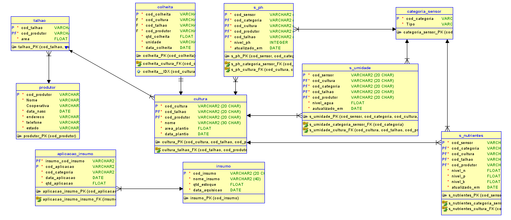

# Modelo de Banco de Dados para Gestão de Plantação (Oracle)

## Visão Geral

Este repositório contém o Modelo Entidade-Relacionamento (MER) / Entity-Relationship Diagram (ERD) para um banco de dados Oracle projetado para gerenciar informações de uma empresa de plantação. O modelo abrange entidades essenciais como produtores, talhões, culturas, colheitas, insumos agrícolas e dados de sensores (pH, umidade, nutrientes).

## Diagrama Entidade-Relacionamento (MER/ERD)

O diagrama visual do modelo de banco de dados está incluído neste repositório:

*(Certifique-se de que o arquivo `mer.png` esteja na mesma pasta ou ajuste o caminho acima)*

## Escopo do Modelo

O banco de dados foi modelado para suportar as seguintes funcionalidades:

* **Cadastro de Produtores:** Informações sobre os agricultores associados.
* **Gerenciamento de Talhões:** Detalhes sobre as áreas de plantio (localização, área).
* **Controle de Culturas:** Rastreamento das culturas plantadas em cada talhão, incluindo datas e áreas.
* **Registro de Colheitas:** Dados sobre as colheitas realizadas (quantidade, data, cultura associada).
* **Gestão de Insumos:** Cadastro de insumos agrícolas (fertilizantes, pesticidas, etc.) e registro de suas aplicações nos talhões.
* **Monitoramento por Sensores:** Coleta e armazenamento de dados de diferentes tipos de sensores (pH, umidade, nutrientes) associados aos talhões, culturas e produtores, incluindo categorias de sensores e datas de atualização.

## Estrutura do Banco de Dados

O modelo é composto pelas seguintes tabelas principais:

* `produtor`: Armazena dados dos produtores.
* `talhao`: Armazena dados dos talhões (áreas de plantio).
* `cultura`: Armazena informações sobre as culturas plantadas.
* `colheita`: Registra as colheitas realizadas.
* `insumo`: Catálogo de insumos agrícolas.
* `aplicacao_insumo`: Registra a aplicação de insumos nos talhões.
* `categoria_sensor`: Define os tipos ou categorias de sensores utilizados.
* `s_ph`: Armazena leituras do sensor de pH.
* `s_umidade`: Armazena leituras do sensor de umidade.
* `s_nutrientes`: Armazena leituras do sensor de nutrientes (Nível N, P, K).

**Convenção de Nomenclatura:**

* Chaves Primárias (PK) geralmente seguem o padrão `nome_tabela_PK` ou `cod_identificador_PK`.
* Chaves Estrangeiras (FK) geralmente seguem o padrão `cod_tabela_referenciada_FK`.

## Tecnologia

* **SGBD:** Oracle Database

## Como Usar

Este modelo serve como um blueprint para a criação da estrutura física do banco de dados. Os próximos passos envolvem:

1.  Gerar os scripts SQL DDL (Data Definition Language) a partir deste modelo.
2.  Executar os scripts no ambiente Oracle para criar as tabelas, constraints e relacionamentos.
3.  Popular o banco de dados com os dados da empresa.
